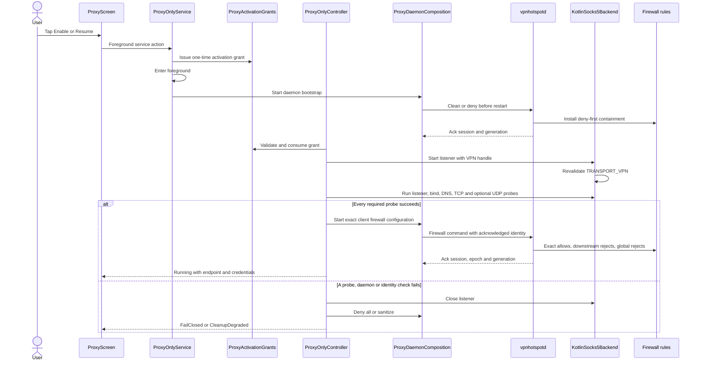
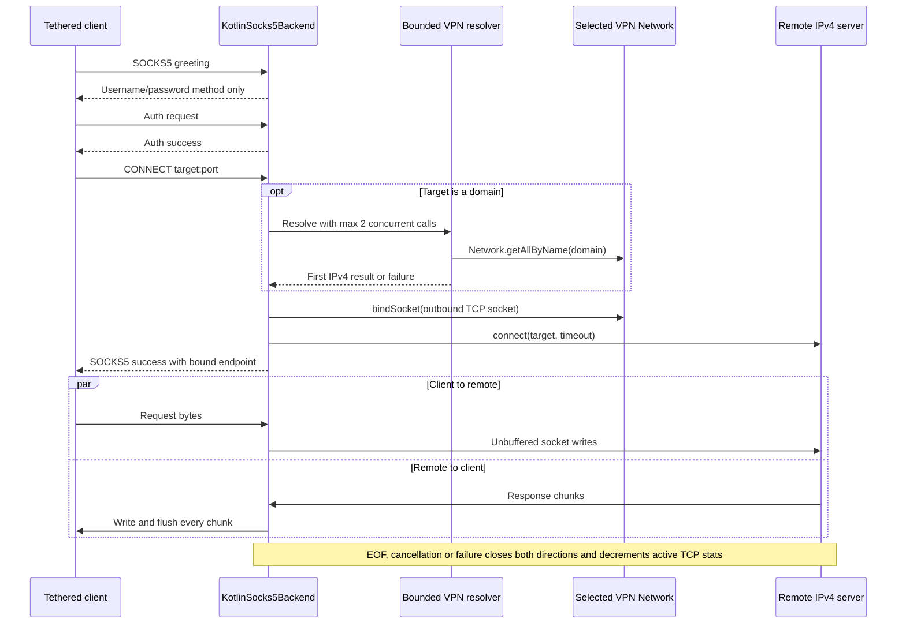
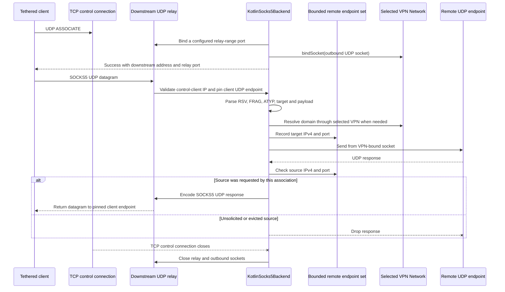
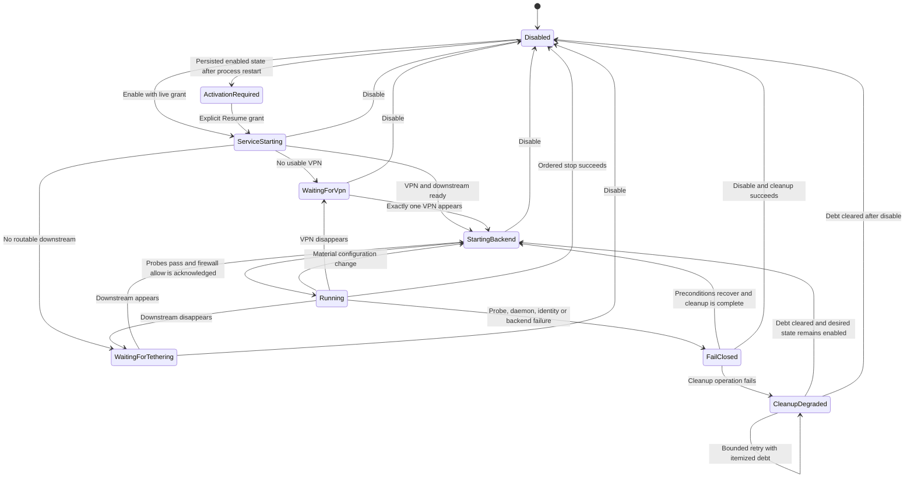
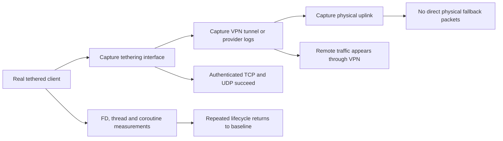

# Track L architecture — Kotlin SOCKS5 data plane

Status: **implemented and CI-verified; rooted-device and packet evidence pending**

This document is the visual architecture companion to
[`TRACK-L-kotlin-socks-backend.md`](../tracks/TRACK-L-kotlin-socks-backend.md). It describes the
implemented Kotlin MVP at executable source head
`db27ed52a539e825f4980fa94098751232377dae`.

The diagrams intentionally separate:

- the **control plane**, which owns activation, desired state, daemon identity, firewall sanitation
  and cleanup debt; and
- the **data plane**, which terminates authenticated SOCKS5 traffic and creates only VPN-bound
  Internet-facing sockets.

## 1. System context and trust boundaries

```mermaid
flowchart LR
    Client["Tethered SOCKS5 client"]
    Internet["Remote IPv4 endpoint"]

    subgraph Android["Android app process"]
        UI["ProxyScreen"]
        Binder["ProxyOnlyService.Binder"]
        Service["ProxyOnlyService"]
        Sources["Preferences + activation grant<br/>VPN + downstream + neighbours"]
        Desired["ProxyDesiredStateSource"]
        Composition["ProxyDaemonComposition"]
        Controller["ProxyOnlyController"]
        ServiceClient["AndroidProxyServiceClient"]
        Backend["KotlinSocks5Backend"]
        VpnNetwork["Selected Android VPN Network"]
    end

    subgraph Root["Root process"]
        Rpc["RootProxyFirewallRpc"]
        Transport["DaemonController framed IPC<br/>reference-counted lease"]
        Daemon["vpnhotspotd"]
        Firewall["proxy_firewall kernel adapter"]
    end

    subgraph Kernel["Linux networking"]
        Rules["Exact client allow rules<br/>then downstream and global rejects"]
    end

    UI --> Binder --> Service
    Sources --> Desired --> Composition --> Controller
    Service --> Controller
    Controller --> ServiceClient --> Backend
    Composition --> Rpc --> Transport --> Daemon --> Firewall --> Rules

    Client ==>|"TCP CONNECT / UDP ASSOCIATE"| Backend
    Backend -.->|"DNS + bindSocket"| VpnNetwork
    VpnNetwork ==>|"VPN-only egress"| Internet

    Rules -.->|"admits exact downstream + IPv4 + MAC"| Client
    Rules -.->|"rejects every other interface and IPv6"| Backend
```

### Boundary ownership

| Boundary | Owner | Enforced invariant |
| --- | --- | --- |
| User activation | `ProxyOnlyService` + `ProxyActivationGrants` | A persisted enable bit is never treated as a live foreground-start grant. |
| App/root IPC | `DaemonController.Lease` + framed request/reply transport | One daemon identity remains stable between firewall calls while the feature is active. |
| Firewall admission | `vpnhotspotd` | Allow requires downstream interface, client IPv4 and client MAC; all later traffic is rejected. |
| SOCKS authentication | `KotlinSocks5Backend` | Username/password authentication is mandatory before CONNECT or UDP ASSOCIATE. |
| VPN egress | Android `Network` selected by the controller | Every Internet-facing socket is bound to the selected VPN before connect or send. |
| Cleanup | Controller + `ProxyServiceCleanupOwner` | A new runtime never starts over unresolved cleanup debt. |

## 2. Activation, sanitation and allow transition

The listener may exist briefly while probes run, but root containment remains deny-first. Client
allow rules are installed only after every required backend probe has succeeded.

## 3. TCP CONNECT path

### TCP invariants

- No process-default network fallback branch exists.
- Domain requests use the selected VPN `Network`.
- Remote-to-client relay flushes every copied chunk, avoiding buffered stalls for small responses,
  keep-alive HTTP and interactive protocols.
- IPv6 targets are rejected with SOCKS5 `ADDRESS_NOT_SUPPORTED`.

## 4. UDP ASSOCIATE path

### UDP invariants

- The success reply advertises the downstream address selected by the TCP control connection, not
  `0.0.0.0`.
- The client UDP source is pinned after the first accepted datagram.
- `FRAG != 0` and IPv6 targets are rejected.
- Replies are relayed only when their remote IPv4 address and port are in the bounded recent set of
  endpoints requested by that association.
- Closing the TCP control connection terminates the UDP association.

## 5. Runtime and cleanup state model

### Ordered stop

The normal disable path is:

1. close the current backend listener and all tracked sockets;
2. cancel and join the backend runtime root job;
3. deny and stop the root firewall state;
4. release the daemon lease and clear acknowledgement-backed daemon health;
5. stop foreground state on the Android main thread; and
6. stop the service.

For OS-driven `Service.onDestroy()`, the main thread only initiates cancellation. An independent IO
scope performs worker join, cleanup-owner close and daemon-resource release, so lifecycle callbacks
are not blocked by root IPC or network teardown.

## 6. DNS boundedness and cancellation boundary

The implemented resolver is deliberately bounded:

- `Dispatchers.IO.limitedParallelism(2)` limits concurrent blocking `Network.getAllByName` calls;
- each requesting coroutine has a five-second timeout; and
- failures remain fail-closed with no alternate resolver or physical-network fallback.

`Network.getAllByName` is a blocking platform call and does not accept a cancellation signal. The
five-second timeout releases the **caller**, but an already-running resolver worker may remain
blocked until Android's resolver returns. Under a DNS blackhole, both resolver workers can therefore
remain occupied for the platform timeout while later callers fail at their own five-second deadline.
This is bounded and fail-closed, but not immediately interruptible.

A future hardening step may replace domain resolution with Android's asynchronous `DnsResolver`
API plus `CancellationSignal`. That change requires rooted-device DNS-blackhole evidence and must
preserve the same selected-VPN-only boundary.

## 7. Failure containment matrix

| Failure | Immediate behavior | Recovery boundary |
| --- | --- | --- |
| No VPN or multiple VPNs | Listener is not allowed to become reachable. | Wait for exactly one usable VPN. |
| VPN disappears while running | Close backend and remove allow state. | Re-enter startup only after VPN selection stabilizes. |
| DNS timeout or no IPv4 answer | Fail the request or startup probe closed. | Retry through the selected VPN only. |
| Root daemon disconnect or identity change | Clear daemon health and reject stale firewall tokens. | Reacquire lease, sanitize, then obtain a fresh acknowledgement. |
| Backend socket or relay failure | Close tracked sockets and publish typed failure. | Controller cleanup and restart after debt is clear. |
| Firewall cleanup failure | Keep listener closed and record itemized cleanup debt. | Service-owned bounded retry supervisor. |
| Process restart with `enabled=true` | Show `ActivationRequired`; do not start listener or root daemon. | User must explicitly tap Resume. |

## 8. Device and packet evidence map

Release evidence still required:

1. TCP CONNECT and UDP ASSOCIATE from real tethered clients;
2. VPN include/exclude, permission denial, VPN loss and DNS-blackhole behavior;
3. packet capture proving no physical-network fallback;
4. active-runtime daemon restart and acknowledgement recovery;
5. repeated enable, disable and process-death FD/thread/coroutine measurements; and
6. Android-version foreground-service and notification behavior.

The PR remains draft until those device rows pass.
