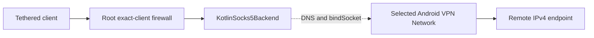

# Track L — Kotlin SOCKS5 MVP data plane

Status: **implemented and build-verified; physical network evidence pending**

## Backend choice

The MVP uses an app-owned Kotlin backend behind the existing `ProxyBackend` interface instead
of claiming the unpinned Hev/JNI integration is complete. This is the fallback explicitly
allowed by the implementation plan when the native feasibility spike is not yet proven.

## Architecture

The [architecture diagram index](../architecture/README.md) links the visual companions for the
proxy-only tracks. Track L's full system context, request sequences, lifecycle model, trust
boundaries and device capture plan are documented in
[Track L Kotlin SOCKS5 architecture](../architecture/TRACK-L-kotlin-socks5-architecture.md).

The root firewall is the client-admission boundary. `KotlinSocks5Backend` is the authenticated
protocol and relay boundary. The selected Android VPN `Network` is the only implemented egress
boundary.

## Protocol support

`KotlinSocks5Backend` implements:

- SOCKS5 method negotiation;
- mandatory username/password authentication;
- IPv4 TCP `CONNECT`;
- IPv4/domain UDP `ASSOCIATE`;
- bounded concurrent UDP associations;
- configured UDP relay port-range allocation;
- bidirectional TCP relay with per-chunk downstream flushing;
- SOCKS5 UDP header parsing and response encoding;
- bounded remote-endpoint validation for UDP replies;
- backend statistics for active TCP and UDP sessions.

IPv6 destinations are not admitted in the MVP. IPv6 listener/relay access remains rejected by
the root firewall.

## VPN-only egress

The backend resolves the selected `Network` from the controller's VPN handle and revalidates
`TRANSPORT_VPN` before startup.

Every Internet-facing socket is bound with `Network.bindSocket` before connect/send. Domain
requests use `Network.getAllByName`, so they use the selected VPN's resolver path rather than
the process-default network. There is no physical-network fallback branch.

DNS work is limited to two concurrent resolver calls and each requesting coroutine has a
five-second deadline. This prevents unbounded resolver concurrency and makes callers fail closed.
The underlying `Network.getAllByName` call is blocking and cannot be interrupted by coroutine
cancellation, so a resolver worker that already entered the platform call may remain occupied
until Android's resolver returns. The architecture document records this boundary and the future
`DnsResolver` plus `CancellationSignal` hardening option.

## Probes

Before the firewall transitions from deny to allow, the backend reports typed results for:

- listener readiness;
- app-UID VPN socket binding;
- VPN-aware DNS;
- outbound TCP;
- outbound UDP when enabled.

The controller requires every configured probe and maps failures into typed fail-closed states.

## Listener containment

The server supports multiple downstreams with one IPv4 wildcard listener. The authoritative
root firewall now orders rules as:

1. exact interface + source IPv4 + source MAC accepts for allowed clients;
2. per-downstream rejects;
3. unconditional TCP/UDP rejects for every other interface;
4. return.

Thus a wildcard socket is unreachable from VPN, loopback, physical Wi-Fi or any other
non-approved interface. IPv6 has unconditional rejects and no allow path.

## UDP containment and interoperability

The UDP success reply advertises the downstream address selected by the TCP control connection,
not `0.0.0.0`, so clients receive a reachable relay endpoint. Each association keeps a bounded
recent set of remote IPv4 address/port pairs that the client actually requested. Packets arriving
from any other endpoint are discarded rather than reflected to the tethered client.

## Lifecycle

The service is the sole owner of backend handles. Waiting/fail-closed states close the current
listener. Stop and emergency-close are idempotent, retain unresolved handles on failure and feed
itemized cleanup debt back into the Track C retry supervisor.

Backend shutdown closes all tracked sockets, cancels the runtime root job and joins the complete
runtime coroutine tree. Android `Service.onDestroy()` no longer blocks the main thread: the OS
fallback cancellation path preserves worker-join-before-cleanup-owner ordering on an independent
IO scope. Foreground stop calls are dispatched to the main thread.

## Files

- `proxy/KotlinSocks5Backend.kt`
- `proxy/ProxyOnlyService.kt`
- `proxy/KotlinSocks5BackendHelpersTest.kt`
- `rust/vpnhotspotd/src/proxy_firewall_kernel.rs`
- `docs/proxy-only/architecture/README.md`
- `docs/proxy-only/architecture/TRACK-L-kotlin-socks5-architecture.md`

## Verification

The backend compiles into all configured Android ABIs and the complete Android/JVM workflow,
Rust firewall tests, clippy, audit, Dependency Review and release R8 passed on executable head
`db27ed52a539e825f4980fa94098751232377dae`.

Focused JVM regressions prove that relay output is flushed once per copied chunk and that the UDP
remote allowlist remains bounded while refreshing recently used endpoints.

## Remaining evidence before release

Build verification is not a substitute for packet-level/device evidence. Required follow-up:

- real VPN include/exclude tests;
- TCP and UDP client interoperability;
- VPN DNS blackhole and VPN-loss tests;
- packet capture proving no physical fallback;
- daemon restart while running;
- repeated start/stop FD and coroutine leak measurements;
- Android-version foreground-service validation.

The PR remains draft until those device rows pass.
